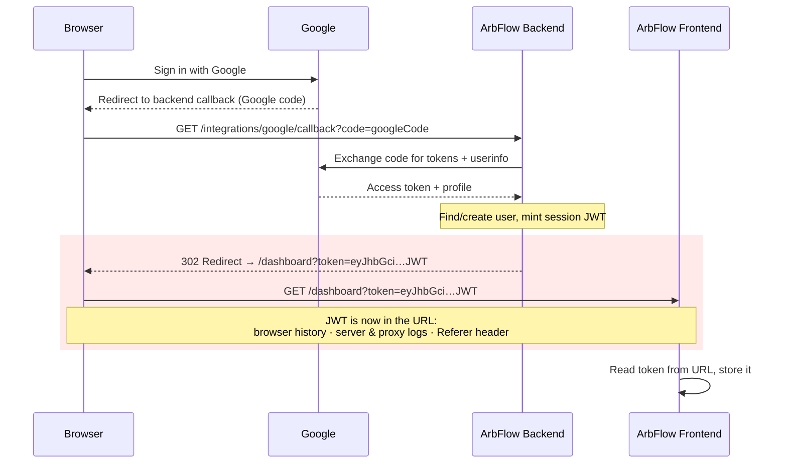

# Why I Don't Put JWTs in Redirect URLs

*A small auth decision from building ArbFlow, and the reasoning behind it.*

---

## TL;DR

When you finish an OAuth login, the tempting move is to redirect the browser back to your app with the session token in the URL: `myapp.com/callback?token=eyJhbGci...`. It works on the first try, which is exactly why it's dangerous. URLs leak — into browser history, server logs, and `Referer` headers. So instead of handing back the token, I hand back a **single-use, short-lived, hashed authorization code**, and the frontend exchanges it for the real token over a POST. It's the same reasoning that killed OAuth's implicit flow, applied to the last hop of my own login.

---

## The shortcut that works (and why that's the trap)

Here's the flow I needed in ArbFlow: user signs in with Google, my backend verifies them and mints an ArbFlow session JWT, and the frontend (a separate origin on Vercel) needs to end up holding that JWT.

The obvious wiring is to redirect the browser from my backend callback straight to the frontend with the token in the query string. In ArbFlow's shape, the "don't do this" version looks like this:

```python
# DON'T do this — the JWT is now in the URL.
return RedirectResponse(
    url=f"{FRONTEND_URL}/dashboard?token={jwt_token}"
)
```

The frontend reads `token` from the URL, drops it in storage, done. It works the first time you test it. No error, no friction. And because it works, it's easy to never think about it again.

The problem is that a JWT is a **bearer token** — whoever holds it *is* the user until it expires. And a URL is one of the least private places you can put a secret.

---

## Where URLs leak

*The before picture — the red hop is where the JWT sits in the URL:*



Four channels, all of them boring and all of them real:

**Browser history.** The full URL, query string included, gets written to history. Anyone with access to that machine can scroll back and read the token. Shared or public computers make this worse.

**Server and infrastructure logs.** Access logs across web servers, reverse proxies, load balancers, and CDNs routinely record the request line — which includes the query string. Your token is now sitting in plaintext in log files you may not even own, possibly shipped to a third-party logging service.

**The `Referer` header.** When the callback page loads and makes any request to another origin, the browser can attach the current URL — token and all — as the `Referer`. Modern browsers default to `strict-origin-when-cross-origin`, which strips the path and query on cross-origin requests, so this is *mitigated* today — but "mitigated by a default someone can override" is not the same as "safe."

**Humans.** URLs live in the address bar. People copy them, paste them into chats, bookmark them, screenshot them. A token in the URL rides along every time.

Putting a fragment (`#token=...`) instead of a query param dodges the server-log problem, since fragments aren't sent to the server. This is exactly what OAuth's old **implicit flow** did. It's also why the implicit flow got deprecated — the fragment still lands in history and is still readable by any JavaScript on the page. Moving the leak around isn't fixing it.

---

## The fix: hand back a claim ticket, not the prize

Instead of putting the token in the redirect, my backend puts a **short-lived authorization code** there. The frontend then trades that code for the real token over a normal POST request.

The redirect carries a value that is:

- **Single-use** — consumed (in fact, deleted) the moment it's exchanged, so a replay from history or logs hits a dead code.
- **Short-lived** — a 120-second TTL. The window where the code means anything is tiny.
- **Hashed at rest** — I store `sha256(code)`, not the code itself. The browser holds the raw code; on exchange I hash the incoming value and look it up. A database dump gives an attacker hashes, not usable codes.
- **Not a bearer credential for the API** — even if the code leaks, it isn't a key to anything. It's a claim ticket that only works once, only for a moment, only against my exchange endpoint.

The actual JWT comes back in the **response body** of the exchange call — which isn't written to browser history, isn't in the URL, and isn't sent as a `Referer`.

*The after picture — only a single-use claim ticket touches the URL; the green hop is the JWT arriving in a POST body:*

```mermaid
sequenceDiagram
    participant U as Browser
    participant G as Google
    participant BE as ArbFlow Backend
    participant FE as ArbFlow Frontend

    U->>G: Sign in with Google
    G-->>U: Redirect to backend callback (Google code)
    U->>BE: GET /integrations/google/callback?code=googleCode
    BE->>G: Exchange code for tokens + userinfo
    G-->>BE: Access token + profile
    Note over BE: Find/create user, mint session JWT,<br/>generate random auth_code,<br/>store sha256(auth_code) + JWT · TTL 120s
    BE-->>U: 302 Redirect → /dashboard?auth_code=…
    U->>FE: GET /dashboard?auth_code=…
    Note over U,FE: Only a single-use, 120s,<br/>hashed claim ticket is in the URL
    FE->>BE: POST /api/v1/auth/exchange { code }
    Note over BE: Atomic delete-and-return by code hash;<br/>exactly one caller wins, then check expiry
    rect rgb(230, 245, 233)
    BE-->>FE: 200 { access_token: JWT } — in response body
    end
    FE->>FE: Store JWT, strip ?auth_code from URL
```

Here's the actual ArbFlow code. At the end of the Google callback, I mint the JWT but redirect with an `auth_code` instead of the token (`backend/app/api/integrations.py`):

```python
# Mint the session JWT, but hand the browser a single-use code instead
# of the token itself so the JWT never lands in a URL / history / logs.
expire = datetime.utcnow() + timedelta(hours=24)
jwt_token = jwt.encode({"sub": str(user.id), "exp": expire}, SECRET_KEY, algorithm=ALGORITHM)
auth_code = create_auth_code(db, jwt_token)

return RedirectResponse(url=f"{FRONTEND_URL}/dashboard?auth_code={auth_code}&integration=success")
```

`create_auth_code` is where "hashed at rest" happens — only the sha256 of the code is ever written to the database (`backend/app/core/oauth.py`):

```python
def _hash_code(code: str) -> str:
    """Auth codes are stored hashed, like passwords: a leaked DB row must not
    be redeemable for a session token. sha256 is fine here — the input is a
    256-bit random value, so there's nothing to brute-force."""
    return hashlib.sha256(code.encode("utf-8")).hexdigest()


def create_auth_code(db: Session, token: str) -> str:
    """Persist a JWT behind a fresh single-use code and return the code.

    Only the sha256 of the code touches the database; the plaintext code goes
    to the browser once, in the redirect URL, and is never stored.
    """
    code = secrets.token_urlsafe(32)
    db.add(AuthCode(code=_hash_code(code), token=token))
    db.commit()
    return code
```

The exchange endpoint trades a valid code for the token. There's nothing to brute-force here in the first place — the code is 256 bits of entropy, so guessing a valid one is infeasible no matter how many tries you get — but the endpoint is rate-limited anyway, as plain defense-in-depth against abuse (`backend/app/api/auth.py`):

```python
@router.post("/exchange")
def exchange_auth_code(payload: AuthCodeExchange, request: Request, db: Session = Depends(get_db)):
    """Exchange a single-use OAuth `auth_code` for the session JWT.

    Keeps the long-lived token out of the redirect URL: the callback hands the
    browser an opaque code, and the frontend trades it here for the real token.
    """
    enforce_rate_limit(request, "exchange")
    token = consume_auth_code(db, payload.code)
    if not token:
        raise HTTPException(status_code=400, detail="Invalid or expired code")
    return {"access_token": token, "token_type": "bearer"}
```

The single-use guarantee lives in `consume_auth_code` — and this is the part I got subtly wrong the first time, so it's worth slowing down on (`backend/app/core/oauth.py`):

```python
def consume_auth_code(db: Session, code: str) -> str | None:
    """Atomically claim a single-use code and return its JWT (or None)."""
    row = db.execute(
        delete(AuthCode)
        .where(AuthCode.code == _hash_code(code))
        .returning(AuthCode.token, AuthCode.created_at)
    ).first()
    db.commit()

    if row is None:
        return None

    token, created_at = row
    cutoff = datetime.utcnow() - timedelta(seconds=AUTH_CODE_TTL_SECONDS)
    return None if created_at < cutoff else token
```

My first version did the obvious thing: `SELECT` the row by code hash, check it, then `DELETE` it — two statements. That reads fine and passes every single-threaded test. But "single-use" is the *entire* security value of the claim-ticket, and two statements aren't atomic. Under Postgres's default `READ COMMITTED` isolation, two concurrent exchanges of the same code can both run the `SELECT` before either commits its `DELETE` — and both walk away with the JWT.

In this threat model that's the whole ballgame. The post's promise is "sure, the code leaked into history or logs, but it's already spent." An attacker who intercepts the code and *races* the legitimate frontend breaks exactly that promise — and the client-side dedupe you'll see below does nothing about it, because that only stops React from racing *itself*, not a real concurrent request from somewhere else.

The fix is a one-liner that makes the guarantee true: consume with a single `DELETE ... RETURNING` instead of select-then-delete. The `DELETE` takes the row lock, so exactly one caller gets the row back; the loser re-reads under `READ COMMITTED`, finds nothing, and gets `None`. Expiry becomes a check on the row you actually claimed — no separate table-wide cleanup pass racing alongside the consume. (I dropped that per-request cleanup with this change; the rare never-exchanged code expires harmlessly and a periodic sweep can prune it if the table ever grows.)

And the frontend reads the code out of the URL once, swaps it, stores the token, and scrubs the code from the address bar (`frontend/src/lib/auth.ts`):

```ts
// Module-level: dedupes the single-use code across React's double-invokes.
let pending: { code: string; promise: Promise<boolean> } | null = null;

async function exchange(code: string): Promise<boolean> {
  const res = await fetch(`${getApiUrl()}/api/v1/auth/exchange`, {
    method: "POST",
    headers: { "Content-Type": "application/json" },
    body: JSON.stringify({ code }),
  });
  if (!res.ok) return false;

  const data = await res.json();
  if (!data.access_token) return false;

  localStorage.setItem("token", data.access_token);

  // Remove the (now-spent) code from the URL + history, keep other params.
  const params = new URLSearchParams(window.location.search);
  params.delete("auth_code");
  const query = params.toString();
  window.history.replaceState({}, "", window.location.pathname + (query ? `?${query}` : ""));
  return true;
}

// After Google sign-in, the backend redirects with a single-use `?auth_code=`.
export async function consumeAuthCode(): Promise<boolean> {
  if (typeof window === "undefined") return false;

  const code = new URLSearchParams(window.location.search).get("auth_code");
  if (!code) return false;

  // React can mount the auth guard twice (Strict Mode), and the code is
  // single-use — so dedupe: reuse the in-flight promise for the same code
  // instead of spending an already-consumed code on the second call.
  if (pending && pending.code === code) return pending.promise;

  const promise = exchange(code);
  pending = { code, promise };
  return promise;
}
```

That last dedupe is a small real-world wrinkle worth calling out: because the code is genuinely single-use, React Strict Mode invoking the effect twice would have the second call fail on an already-spent code. Memoizing the in-flight promise per code makes the client resilient to its own double-invokes.

---

## "Wait — isn't this just OAuth?"

Yes. And that's the point.

This is the **authorization code flow** that OAuth 2.0 already uses between an app and an identity provider: you don't get the access token in a redirect, you get a code you exchange for one. I ended up rebuilding that same pattern for the *last hop* — between my own backend callback and my own SPA — because that hop has the exact same problem the OAuth designers were solving.

Reinventing a well-understood pattern isn't something to hide. Running into the problem yourself and arriving at the same answer is a decent sign the answer is right.

- OAuth 2.0 authorization code grant — [RFC 6749 §4.1](https://datatracker.ietf.org/doc/html/rfc6749#section-4.1)
- Why implicit flow is discouraged — [OAuth 2.0 Security Best Current Practice, RFC 9700](https://datatracker.ietf.org/doc/html/rfc9700)

---

## The tradeoff I'm not going to pretend isn't there

The auth-code handoff protects the token **in transit** — how it gets from my backend to my frontend. It does nothing about where the token lives afterward.

In ArbFlow, the JWT ends up in `localStorage`. That means any successful XSS on my frontend can read it. The handoff closes the URL-leak channels; it doesn't close that one. The more complete answer is an `httpOnly` cookie the browser stores and JS can't touch — which comes with its own baggage (CSRF, `SameSite` behavior across my separate frontend and API origins, mobile clients) that I made a deliberate call to defer.

So: delivery, solved and I'm confident in it. Storage, a known tradeoff with a clear next step. I'd rather write that down than imply the whole thing is airtight. (I keep this documented in the project's `ARCHITECTURE.md` and auth audit so it doesn't quietly get forgotten.)

---

## Rules of thumb I took away

- A URL is a **public surface**. History, logs, and `Referer` all see it. Never put a bearer credential there.
- If you must pass something through a redirect, pass a **claim ticket**, not the prize: single-use, short-lived, hashed at rest, useless on its own.
- Deliver the real token in a **response body**, never a URL.
- When your homegrown solution converges on an existing standard (here, the OAuth authorization code flow), that's usually confirmation, not coincidence.
- Name your remaining tradeoffs out loud. "Delivery is solid, storage is a known gap" is a stronger position than pretending there isn't one.

---

*ArbFlow is the multi-tenant analytics SaaS this decision came from. Built by Pranav Shukla.*
